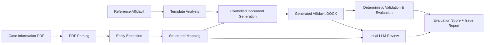

# Legal Document Generation & Evaluation Agent

An AI-assisted document intelligence system that extracts structured information from a supplied case-information PDF and generates an Affidavit in Reply using a supplied reference format. The system uses deterministic rules for factual extraction, document generation, validation, and evaluation, while a local Hugging Face LLM provides an additional review for possible inconsistencies or unsupported information. The generated affidavit and evaluation report are saved as reusable project artifacts.

## Features

* Extracts case information from PDF documents
* Analyzes the structure of the reference Affidavit in Reply
* Converts extracted information into structured JSON
* Performs pre-generation validation
* Generates a formatted Affidavit in Reply as a DOCX file
* Performs deterministic document validation
* Evaluates the generated document across multiple dimensions
* Detects missing or inconsistent information
* Performs an additional local LLM review
* Automatically saves generated artifacts
* Provides a Streamlit interface for the complete workflow

---

## Workflow

```text
Reference Affidavit
        │
        ▼
Template Structure Analysis
        │
        │
Case Information PDF
        │
        ▼
PDF Text Extraction
        │
        ▼
Entity Extraction
        │
        ▼
Structured Case Mapping
        │
        ▼
Pre-Generation Validation
        │
        ▼
Controlled Affidavit Generation
        │
        ▼
Generated Affidavit DOCX
        │
        ├───────────────┐
        ▼               ▼
Deterministic       Local LLM
Validation          Review
        │               │
        └───────┬───────┘
                ▼
        Evaluation Report
```

---

## Architecture



---

## Evaluation Dimensions

The generated affidavit is evaluated using deterministic checks across the following dimensions:

| Dimension         | Maximum Score |
| ----------------- | ------------: |
| Entity Accuracy   |            25 |
| Completeness      |            15 |
| Structure         |            20 |
| Consistency       |            15 |
| Template Fidelity |            15 |
| Hallucination     |            10 |
| **Total**         |       **100** |

### Deterministic Validation Checks

The system checks:

1. Required sections are present
2. Paragraph numbering is sequential
3. Verification paragraph range matches the actual body paragraph count
4. Jurat and verification are consistent
5. Required exhibit reference is present

These checks do not depend on the LLM.

---

## Local AI Review

The project uses:

**Hugging Face SmolLM2-360M-Instruct**

The model runs locally using PyTorch and Hugging Face Transformers.

The LLM is used as a **supporting reviewer**, not as the source of truth for legal facts.

During development, direct free-form LLM generation was evaluated. A smaller local model could potentially alter the meaning of supplied legal statements. Therefore, the final architecture uses deterministic generation for the affidavit and uses the local LLM only to identify possible inconsistencies or unsupported information.

This design reduces the risk of changing supplied legal facts while still incorporating an AI-based review component.

---

## Project Structure

```text
Legal_doc_AI/
│
├── app.py
├── requirements.txt
├── README.md
├── .gitignore
├── .env.example
│
├── data/
│   ├── 01 Affidavit Format Explained.pdf
│   ├── 02 Affidavit in Reply Sample.docx.pdf
│   └── 03_Case_Information.pdf
│
├── src/
│   ├── document_parser.py
│   ├── entity_extractor.py
│   ├── template_analyzer.py
│   ├── mapper.py
│   ├── generator.py
│   ├── validator.py
│   ├── evaluator.py
│   └── llm_generator.py
│
└── outputs/
    ├── generated_affidavit.docx
    ├── generated_affidavit.txt
    ├── mapped_case.json
    ├── evaluation_report.md
    └── uploaded_case_information.pdf
```

---

## Technologies Used

* Python 3.11
* Streamlit
* PyMuPDF
* python-docx
* Pydantic
* Hugging Face Transformers
* PyTorch
* Accelerate
* Python regular expressions
* JSON

---

## Installation

### 1. Clone the repository

```bash
git clone https://github.com/Reshkee01/DocGEN.git
cd DocGEN
```

### 2. Create a virtual environment

```bash
python3.11 -m venv .venv
```

### 3. Activate the virtual environment

macOS/Linux:

```bash
source .venv/bin/activate
```

### 4. Install dependencies

```bash
pip install -r requirements.txt
```

### 5. Run the application

```bash
streamlit run app.py
```

The Streamlit application will open in your browser.

---

## Usage

1. Start the Streamlit application.
2. Upload the supplied Case Information PDF.
3. Click **Generate & Evaluate Affidavit**.
4. The application analyzes the reference affidavit.
5. Case entities are extracted and converted into structured data.
6. Pre-generation validation is performed.
7. The Affidavit in Reply is generated.
8. Deterministic validation and evaluation are performed.
9. The local LLM performs an additional review.
10. The final evaluation report is automatically saved.

---

## Generated Artifacts

After running the application, the following files are generated in `outputs/`:

```text
outputs/
├── generated_affidavit.docx
├── generated_affidavit.txt
├── mapped_case.json
├── evaluation_report.md
└── uploaded_case_information.pdf
```

### Generated Affidavit

`generated_affidavit.docx`

The generated Affidavit in Reply follows the supplied reference structure, including:

* Court heading
* Jurisdiction
* Case number
* Cause title
* Respondents
* Affidavit title
* Deponent clause
* Numbered reply paragraphs
* Prayer
* Jurat
* Verification
* Advocate block

### Structured Case Data

`mapped_case.json`

Contains the extracted and mapped case information used as the source of truth during document generation.

### Evaluation Report

`evaluation_report.md`

Contains:

* Overall score
* Individual evaluation scores
* Detected issues
* Reference template analysis
* Local AI review

---

## Design Decisions

### 1. Deterministic document generation

The final affidavit is generated from structured case information using controlled templates and rules rather than allowing an LLM to freely rewrite the supplied legal content.

This prevents unnecessary changes to names, dates, respondent numbers, case information, and required legal statements.

### 2. Structured intermediate representation

The extracted case information is converted into structured data before generation.

This creates a clear separation between:

```text
PDF → Extraction → Structured Data → Generation
```

and makes the pipeline easier to validate and debug.

### 3. Pre-generation validation

Important fields are validated before document generation so that incomplete input does not silently produce an incorrect affidavit.

### 4. Deterministic evaluation

The final evaluation score is produced using rule-based checks rather than relying entirely on an LLM.

This makes the evaluation reproducible.

### 5. Local LLM review

A local Hugging Face model is used as an additional reviewer for possible inconsistencies and unsupported information.

The LLM does not directly modify the generated affidavit.

---

## Rejected Approaches

### Free-form LLM document generation

A free-form LLM approach was considered for generating the complete affidavit.

During testing, the smaller local model could alter the meaning of supplied legal statements. Since the case information supplied by the assignment must remain the source of truth, this approach was rejected for final document generation.

### API-based LLM

An API-based LLM was not used. The project uses a local Hugging Face model instead.

This avoids dependence on an external API key for the AI review component.

---

## Limitations

* Entity extraction is primarily rule-based and is currently tailored to the supplied document format.
* The prototype focuses on one document type: Affidavit in Reply.
* It does not perform independent legal research.
* It does not determine whether the supplied legal claims are legally correct.
* DOCX formatting aims to preserve the required structure but is not intended to be pixel-perfect.
* The local LLM review is advisory and is not treated as the authoritative evaluation.
* The system is a proof of concept rather than a production legal-document system.
* Different document layouts may require additional extraction rules.

---

## Failure Cases

The system is designed to detect or prevent several common failures, including:

* Missing required document sections
* Incorrect paragraph numbering
* Verification range not matching the actual paragraph count
* Inconsistent verification/jurat wording
* Missing exhibit references
* Incorrect case information
* Missing important entities
* Potential unsupported information

---

## Assignment Scope

This project uses only the legal content supplied with the assignment.

No independent legal research is performed.

The system focuses on:

```text
Reliable Extraction
        ↓
Structured Mapping
        ↓
Controlled Generation
        ↓
Deterministic Validation
        ↓
Evaluation
        ↓
AI-Assisted Review
```

---

## Working Demo

**GitHub Repository:**
`<ADD_GITHUB_REPOSITORY_LINK>`

**Working Application:**
`https://docgen-1.streamlit.app/`

**Demo Video:**
`<ADD_VIDEO_LINK>`

---

## AI Coding Assistant Disclosure

ChatGPT was used as a coding assistant for guidance, debugging, code drafting, troubleshooting, and documentation during development.

The implementation was tested locally and adapted based on the project's requirements and observed outputs.

---

## Conclusion

This project demonstrates a hybrid approach to AI-assisted legal document generation. Instead of relying entirely on generative AI, it combines deterministic extraction, structured data mapping, controlled document generation, rule-based validation, and local LLM review to improve reliability and reduce the risk of hallucinated or altered case information.

